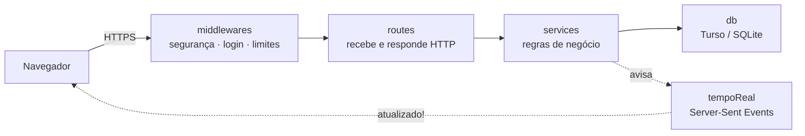
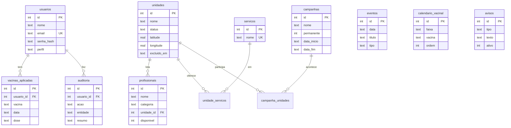
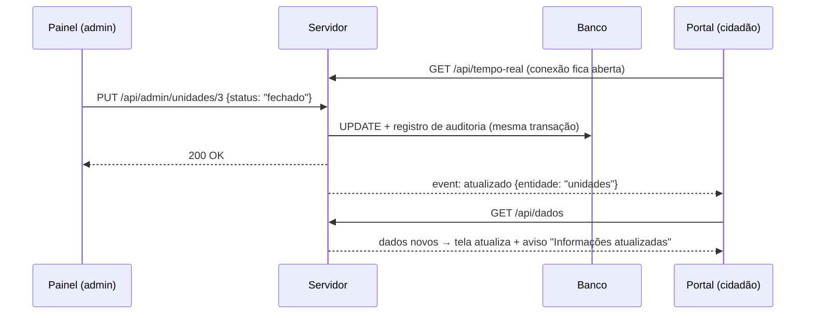

# 🩺 SaúdeMap IA — Saúde Acessível

Portal de saúde pública de **Barra do Garças (MT)**: unidades de saúde com localização e rota no mapa, campanhas de vacinação, profissionais, calendário da saúde, histórico vacinal do cidadão e uma **IA de triagem** que indica a especialidade certa a partir da descrição do sintoma. Todo o conteúdo é gerenciado por um **painel administrativo**, e as alterações aparecem no site **em tempo real**.

🔗 **Site:** https://saude-acessivel.onrender.com
👤 **Autor:** Thiago Henrique Rodrigues de Melo — Informática, IFMT

---

## Sumário

1. [Funcionalidades](#funcionalidades)
2. [Arquitetura: backend × frontend](#arquitetura-backend--frontend)
3. [Estrutura de pastas](#estrutura-de-pastas)
4. [Banco de dados](#banco-de-dados)
5. [Painel administrativo](#painel-administrativo)
6. [Atualização em tempo real](#atualização-em-tempo-real)
7. [API](#api)
8. [Como rodar](#como-rodar)
9. [Testes](#testes)
10. [Publicação (Render)](#publicação-render)
11. [IA de triagem e segurança](#ia-de-triagem-e-segurança)

---

## Funcionalidades

| Para o cidadão | Para a Secretaria de Saúde (admin) |
|---|---|
| Postos ordenados pela distância real, com rota pelas ruas no mapa | Cadastrar, editar e excluir unidades de saúde |
| Campanhas de vacinação com situação automática pela data | Gerenciar campanhas, datas e unidades participantes |
| Profissionais por especialidade e "Horários de Hoje" | Gerenciar profissionais e onde atendem |
| Calendário da saúde (eventos, campanhas, feriados) | Gerenciar o calendário e o calendário vacinal |
| **Meu Histórico** — vacinas que tomou | Registrar vacinas aplicadas em cada cidadão |
| IA de triagem: descreve o sintoma, recebe a especialidade | Avisos da página inicial · usuários e administradores |
| Tudo atualiza sozinho quando a Secretaria muda algo | Auditoria: quem alterou o quê, e quando |

---

## Arquitetura: backend × frontend

O projeto é dividido em **duas camadas independentes**:

| | **Backend** (`backend/`) | **Frontend** (`frontend/`) |
|---|---|---|
| Onde roda | No servidor (Node.js + Express) | No navegador do usuário |
| Responsabilidade | Regras de negócio, banco de dados, autenticação, permissões, API | Telas, interação, mapa, IA de triagem |
| Pode ter segredos? | **Sim** (`.env`: banco, chave do JWT) | **Nunca** — tudo nele é visível para qualquer pessoa |
| Fala com o banco? | Sim | Não — só pela API (`/api/...`) |

> **Sobre "público" e "privado":** nas versões anteriores, as pastas se chamavam `public/` e `private/`. Esses nomes descreviam **permissão de acesso** (quem pode ver a página), não **camada** — e o código do servidor ficava solto na raiz, misturado com as pastas. Na v3, a organização é por **camada**. A regra de quem pode ver cada página continua existindo, mas agora é uma responsabilidade do backend (`backend/src/routes/paginas.routes.js`), e não um nome de pasta.

O comando `npm run check:secrets` **verifica automaticamente** essa separação: falha se houver código de servidor ou segredo dentro de `frontend/`, ou HTML/CSS dentro de `backend/`.

### Camadas do backend

Cada requisição atravessa as camadas sempre no mesmo sentido:



| Camada | O que faz | Não faz |
|---|---|---|
| `middlewares/` | Barra o que não deve passar: sem login, sem permissão, origem estranha, excesso de requisições | Regra de negócio |
| `routes/` | Traduz HTTP ↔ chamadas de serviço (lê `req`, devolve `res`) | SQL |
| `services/` | Regras: validação, transações, auditoria, formato dos dados | Conhecer HTTP |
| `db/` | Conexão, esquema, migrações e carga inicial | Regras |

---

## Estrutura de pastas

```
saude-acessivel/
├── README.md                    ← este arquivo
├── package.json                 dependências e comandos (npm start, npm run verificar...)
├── .env.example                 modelo das variáveis de ambiente (o .env real não vai pro Git)
│
├── backend/                     ══ SERVIDOR (Node.js + Express) ══
│   ├── src/
│   │   ├── server.js            ponto de entrada: prepara o banco e sobe o servidor
│   │   ├── app.js               monta o Express na ordem certa (segurança → API → páginas → erros)
│   │   ├── config/
│   │   │   └── env.js           lê e valida o .env (sem segredo válido, não inicia)
│   │   ├── db/
│   │   │   ├── conexao.js       cliente único do banco (Turso)
│   │   │   ├── schema.sql       as 13 tabelas, com restrições CHECK
│   │   │   ├── migracoes.js     cria/atualiza tabelas a cada início
│   │   │   ├── seed.js          carga inicial (roda uma única vez na vida do banco)
│   │   │   └── dados-iniciais.json   dados que antes ficavam fixos no código
│   │   ├── middlewares/
│   │   │   ├── seguranca.js     HTTPS, cabeçalhos (CSP), verificação de origem (CSRF)
│   │   │   ├── autenticacao.js  sessão (JWT em cookie), login obrigatório, perfil admin
│   │   │   ├── limites.js       limite de requisições por IP
│   │   │   └── erros.js         respostas de erro sem vazar detalhes internos
│   │   ├── routes/
│   │   │   ├── auth.routes.js   cadastro, login, logout, /api/me
│   │   │   ├── dados.routes.js  dados do portal + canal de tempo real
│   │   │   ├── admin.routes.js  API do painel (CRUD de todas as entidades)
│   │   │   └── paginas.routes.js  entrega as páginas (decide quem pode ver cada uma)
│   │   ├── services/
│   │   │   ├── entidades.js     catálogo das entidades: campos, regras, relacionamentos
│   │   │   ├── repositorio.js   criar/listar/editar/excluir genérico, com transação + auditoria
│   │   │   ├── dadosPublicos.js monta os dados do portal (uma ida ao banco, com cache)
│   │   │   ├── usuarios.js      usuários, perfis e histórico vacinal
│   │   │   ├── auditoria.js     registro de quem alterou o quê
│   │   │   └── tempoReal.js     avisa as páginas abertas quando algo muda
│   │   └── utils/
│   │       └── validacao.js     regras de validação de cada tipo de campo
│   └── testes/
│       ├── testar-backend.js    33 testes da camada de dados
│       └── cliente-sqlite.js    banco SQLite em memória para os testes
│
├── frontend/                    ══ NAVEGADOR (HTML + CSS + JavaScript) ══
│   ├── paginas/
│   │   ├── index.html           portal do cidadão
│   │   ├── login.html           entrar / criar conta
│   │   └── admin.html           painel do administrador
│   └── assets/
│       ├── css/                 style.css · login.css · admin.css
│       ├── js/
│       │   ├── dados.js         busca os dados na API e escuta o tempo real
│       │   ├── app.js           portal: telas, mapa, geolocalização, busca
│       │   ├── auth.js          identifica o usuário logado
│       │   ├── login.js         formulários de login e cadastro
│       │   └── admin.js         painel: tabelas e formulários gerados por configuração
│       └── ml/
│           ├── modelo-ia.js     pesos da IA (gerado pelo treinamento)
│           └── sintomas-ia.js   motor da IA de triagem (roda no navegador)
│
├── ia/                          treinamento da IA (Python / Google Colab) + relatório
├── scripts/                     verificar-segredos.js · testar-ia.js
└── docs/
    └── SEGURANCA.md             checklist de segurança detalhado
```

---

## Banco de dados

**Turso** (libSQL, compatível com SQLite), hospedado na nuvem — os dados sobrevivem aos reinícios do servidor. São **13 tabelas**:

| Tabela | Guarda |
|---|---|
| `usuarios` | contas (senha só como hash bcrypt) e perfil `CIDADAO` / `ADMIN` |
| `unidades` | UBS, UPA, hospital: endereço, horário, coordenadas, situação |
| `servicos` · `unidade_servicos` | serviços oferecidos e quais unidades oferecem (N:N) |
| `profissionais` | equipe, especialidade, horário e unidade onde atende |
| `campanhas` · `campanha_unidades` | campanhas de vacinação e unidades participantes (N:N) |
| `eventos` | calendário da saúde |
| `calendario_vacinal` | vacinas recomendadas por faixa etária |
| `avisos` | avisos da página inicial |
| `vacinas_aplicadas` | histórico vacinal de cada cidadão |
| `auditoria` | toda alteração feita no painel |
| `metadados` | controle interno (ex.: carga inicial já aplicada) |



**Decisões de projeto:**
- **Restrições `CHECK` no próprio banco** (status, datas, cores, coordenadas) — a regra vale mesmo se o código tiver um bug.
- **Exclusão lógica** em unidades, profissionais e campanhas: some do site, mas o registro fica (histórico e auditoria preservados).
- **Carga inicial única:** na primeira inicialização, os dados que ficavam fixos no antigo `data.js` são gravados no banco. Uma marca em `metadados` impede que rodem de novo — se o admin apagar todos os avisos, eles **não voltam** no próximo reinício.
- **Datas em ISO** (`AAAA-MM-DD`): ordenam corretamente como texto. A conversão para `DD/MM/AAAA` é feita só na exibição.

---

## Painel administrativo

Acesse **`/admin`** (o link "Admin" aparece no menu do portal para quem é administrador).

| Seção | O que faz |
|---|---|
| **Visão geral** | Contagens do sistema, páginas abertas agora e as últimas 30 alterações (auditoria) |
| **Unidades de saúde** | Nome, situação (aberto/fechado/urgência 24h), endereço, horário, coordenadas, serviços |
| **Profissionais** | Nome, especialidade, categoria, horário, unidade, disponibilidade |
| **Campanhas** | Período ou permanente, ícone, cores, unidades participantes |
| **Calendário da saúde** | Eventos, campanhas e feriados |
| **Calendário vacinal** | Vacinas por faixa etária |
| **Avisos** | Avisos fixos da página inicial (ativar/desativar) |
| **Usuários e vacinas** | Buscar cidadãos, registrar vacinas aplicadas, gerenciar administradores |

O painel é **orientado por configuração**: cada entidade declara seus campos e colunas (em `admin.js` e em `backend/src/services/entidades.js`), e o mesmo código gera tabela, formulário, validação e exclusão. Adicionar uma tela nova é acrescentar uma configuração.

### Como virar administrador
1. Crie a conta normalmente pelo site.
2. Coloque o email em `ADMIN_EMAILS` (no `.env` e no Render).
3. Entre de novo. Depois disso, um admin pode promover outros pela tela **Usuários e vacinas**.

---

## Atualização em tempo real

Quando o admin salva algo, **todas as páginas abertas** recebem os dados novos — sem recarregar. Usa **Server-Sent Events (SSE)**: recurso nativo do navegador (`EventSource`), sem biblioteca extra.



- O aviso parte da **camada de dados** (`repositorio.js`), não das rotas — assim nenhuma alteração "esquece" de avisar.
- O servidor guarda os dados do portal em **cache**, renovado a cada alteração: mil pessoas abrindo o site = uma consulta ao banco.
- Se a conexão cair, o navegador **reconecta sozinho** em 5 segundos.

---

## API

Todas as rotas `/api` (exceto cadastro e login) exigem sessão. As de `/api/admin` exigem perfil **ADMIN**, conferido no banco a cada requisição.

| Método | Rota | Descrição |
|---|---|---|
| `POST` | `/api/registro` | Criar conta |
| `POST` | `/api/login` | Entrar |
| `POST` | `/api/logout` | Sair |
| `GET` | `/api/me` | Usuário logado (nome e perfil) |
| `GET` | `/api/dados` | Tudo que o portal exibe |
| `GET` | `/api/me/vacinas` | Histórico vacinal do próprio usuário |
| `GET` | `/api/tempo-real` | Canal de atualização em tempo real (SSE) |
| `GET` `POST` | `/api/admin/{entidade}` | Listar / criar |
| `PUT` `DELETE` | `/api/admin/{entidade}/:id` | Editar / excluir |
| `GET` | `/api/admin/usuarios?busca=` | Buscar usuários |
| `PATCH` | `/api/admin/usuarios/:id/perfil` | Tornar ou remover administrador |
| `GET` `POST` | `/api/admin/usuarios/:id/vacinas` | Histórico vacinal de um cidadão |
| `DELETE` | `/api/admin/usuarios/:id/vacinas/:vacinaId` | Remover registro de vacina |
| `GET` | `/api/admin/resumo` | Números da visão geral |
| `GET` | `/api/admin/auditoria` | Últimas alterações |

`{entidade}`: `unidades`, `profissionais`, `campanhas`, `eventos`, `calendario-vacinal`, `avisos`.

**Erros de validação** voltam com status `400` e o erro de cada campo:
```json
{ "erro": "Verifique os campos destacados.", "detalhes": { "latitude": "Mínimo -16.5." } }
```

---

## Como rodar

**Requisitos:** Node.js 20 ou superior · conta no [Turso](https://turso.tech) (gratuita)

```bash
# 1. Instalar as dependências
npm install

# 2. Criar o .env a partir do modelo e preencher
cp .env.example .env        # no Windows: copy .env.example .env

# 3. Iniciar
npm start
```

| Endereço | Página |
|---|---|
| http://localhost:3000 | Portal do cidadão |
| http://localhost:3000/admin | Painel administrativo |

No Windows, também dá para dar dois cliques em `INICIAR-WINDOWS.bat`.

### Variáveis de ambiente (`.env`)

| Variável | Obrigatória | Para quê |
|---|---|---|
| `TURSO_DATABASE_URL` | sim | Endereço do banco |
| `TURSO_AUTH_TOKEN` | sim | Credencial do banco |
| `JWT_SECRET` | sim | Assina as sessões (mínimo 32 caracteres) |
| `ADMIN_EMAILS` | não | Emails promovidos a administrador |

Gerar um `JWT_SECRET`:
```bash
node -e "console.log(require('crypto').randomBytes(48).toString('hex'))"
```

Na **primeira** inicialização, as 13 tabelas são criadas e a carga inicial é aplicada automaticamente.

---

## Testes

```bash
npm run verificar         # roda tudo abaixo
npm run check:secrets     # segredos no código + separação backend/frontend
npm run test:backend      # 33 testes da camada de dados (requer Node 22+)
npm run test:ia           # JavaScript reproduz exatamente o modelo treinado em Python
npm run audit             # vulnerabilidades conhecidas nas dependências
```

O `test:backend` roda num banco **SQLite em memória** (o `node:sqlite` embutido no Node): não precisa de internet e **não toca no banco de produção**. Cobre tabelas e carga inicial, cadastro/edição/exclusão, validação, proteção contra XSS e mass assignment, auditoria, transações (se a auditoria falhar, a alteração é desfeita), histórico vacinal e tempo real.

---

## Publicação (Render)

| Configuração | Valor |
|---|---|
| Build Command | `npm install` |
| **Start Command** | **`npm start`** |
| Environment | `TURSO_DATABASE_URL`, `TURSO_AUTH_TOKEN`, `JWT_SECRET`, `ADMIN_EMAILS`, `NODE_ENV=production`, `NODE_VERSION=20.11.1` |

A cada `git push` na branch `main`, o Render publica sozinho. O Dependabot (`.github/dependabot.yml`) verifica as dependências toda semana.

---

## IA de triagem e segurança

**IA de triagem** — TF-IDF + Regressão Logística treinada com scikit-learn, com uma camada de sinais de alarme por cima. **91,4%** de acurácia em teste cego e **100%** das urgências detectadas. Roda inteiramente no navegador: o texto digitado **nunca é enviado ao servidor**. Detalhes, metodologia e limitações: [`ia/RELATORIO-IA.md`](ia/RELATORIO-IA.md).

**Segurança** — checklist de 20 itens: senhas com bcrypt, sessão em cookie `HttpOnly`, rate limit, anti-bot, consultas parametrizadas, validação de entrada, CSP, HTTPS forçado, auditoria, proteção contra XSS armazenado e CSRF. Detalhes: [`docs/SEGURANCA.md`](docs/SEGURANCA.md).

> ⚠️ A IA **sugere especialidade, não faz diagnóstico**. Em emergência, ligue **192 (SAMU)**.
